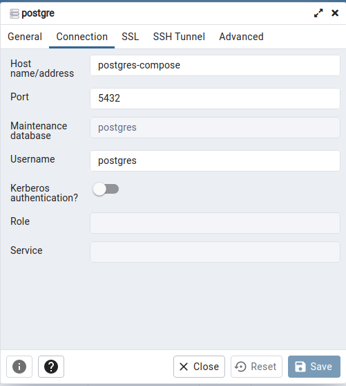

# ligue-challenge

Resolução do teste para desenvolvedor backend da LIGUE

# Solução realizada utilizando:
 * NodeJS;
 * Framework express;
 * Testes com Jest;
 * Migration com Sequelize;
 * Banco de dados para testes sqlite;
 * Banco de dados postgres, 
# Gerenciamento de pacotes
* yarn;
# Banco de Dados
Para iniciar a imagem docker, basta executar o arquivo \dabase_docker\docker-compose.yml com o comando: 
```
docker-compose up -d
``` 
acesso ao pgadmin4 web: http://localhost:16543 e configuração conforme imagem abaixo. Senhas dentro do arquivo docker-compose.yml  
 *  

# Testes
Os testes ao serem executados todos de uma única vez com o comando `yarn test` está ocorrendo algum erro não identificado de "dados residuais", porém ao executar cada um individualmente não ocorre erro:
```
yarn test deleteDeveloper
```
```
yarn test createDeveloper
```
```
yarn test listDeveloper
```
```
yarn test updateDeveloper
```
# Aplicação
Para iniciar a aplicação executar o comando, que será inicializado na porta 3000:
 ```
 node src/server.js
 ```

# Dependências:
|Pacote|Versão
|---|---|
|dotenv|10.0.0|
|express|4.17.1|
|pg|8.7.1|
|sequelize|6.7.0|
|jest|27.2.5|
|nodemon|2.0.13|
|sequelize|6.2.0|
|sqlite3|5.0.2|
|supertest|6.1.6|

## Executar os seguintes comandos para baixar as dependências:

### Pacotes do ambiente
yarn add dotenv express pg sequelize

### Pacotes do ambiente de desenvolvimento
yarn add jest nodemon sequelize-cli sqlite3 supertest -d

# Endpoints
|Método|Ação|
|---|---|
|GET /developers | Retorna todos os desenvolvedores|
|GET /developers/filter?|Retorna os desenvolvedores de acordo com o termo passado via querystring e paginação|
|GET /developers/{id}|Retorna os dados de um desenvolvedor|
|POST /developers|Adiciona um novo desenvolvedor|
|PUT /developers/{id}|Atualiza os dados de um desenvolvedor|
|DELETE /developers/{id}|Apaga o registro de um desenvolvedor|

A collection do postman para as requisições está na pasta `\postman-collection\node-collection.postman_collection.json`

# Especificação
https://bitbucket.org/gabrielsartor/ligue-challenge/src/master/README.md